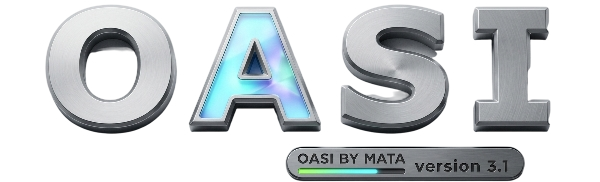

# OASI

<p align="center">
  
</p>

<p align="center">
  <strong>An advanced reconnaissance and web scanner script.</strong><br>
  Coded with ❤️ by <strong>Mata</strong>
</p>

<p align="center">
  
  
  
</p>

---

## 🚀 Features

OASI comes packed with comprehensive information gathering and scanning capabilities:

### Core Reconnaissance
* **Host Verification:** Validates target availability and resolves `Host IP`.
* **Security Headers Check:** Analyzes HTTP response headers for security misconfigurations.
* **WAF Detection:** Detects Web Application Firewalls protecting the target.
* **CMS Scanning:** Identifies common Content Management Systems (WordPress, Joomla, etc.).
* **Robots & Sitemap Auditing:** Automatically checks for `robots.txt` and `sitemap.xml`.
* **DNS & Whois Lookup:** Fetches complete domain configuration and registration details.
* **Reverse IP Lookup:** Discovers other domains hosted on the same server IP.

### Advanced Scanning
* **Subdomain Scanner:** Discovers active subdomains mapping the attack surface.
* **Directory & Upload Check:** Scans for standard upload directories and exposed file paths.
* **Web Shell & Directory Scanner:** Custom wordlist-based fuzzing to expose hidden directories and backdoor shells.
* **Port Scanner:** Performs basic network port sweeps on the target host.

---

## 📦 Installation

Modern Linux distributions (like Kali Linux, Ubuntu, and Debian) restrict global pip installations via PEP 668. To prevent system package conflicts, it is highly recommended to install the dependencies inside a virtual environment:

```bash
# Clone the repository
git clone [https://github.com/MataGreek/oasi.git](https://github.com/MataGreek/oasi.git)

# Navigate into the project folder
cd oasi/

# Create and activate a virtual environment
python3 -m venv .venv
source .venv/bin/activate

# Install the required dependencies
pip3 install -r requirements.txt

```

> 💡 **Tip for Quick Global Setup:** If you prefer to bypass the Linux restriction and install packages globally without a virtual environment, you can append the system override flag:
> `pip3 install -r requirements.txt --break-system-packages`

---

## 🛠️ Usage

> [!WARNING]
> Provide the target URL **without** protocol prefixes (`http://` or `https://`) or trailing slashes (`/`).

### Standard Scan

```bash
python3 oasi.py -u <target>

```

### Custom Wordlist Scan

```bash
python3 oasi.py -u <target> -w /path/to/wordlist.txt

```

### Batch Mode (Bypass Inputs)

Use the `--batch` command to automatically answer "Yes" to all interactive user prompts.

```bash
python3 oasi.py -u <target> --batch

```

### Deep Web Shell Scan

Force deep inspection for potentially exposed administrative or malicious web shells.

```bash
python3 oasi.py -u <target> --shell

```

---

## 📋 Available Arguments

| Short | Long Flag | Description |
| --- | --- | --- |
| `-h` | `--help` | Show the help menu and operational flags |
| `-u` | `--url` | **Required:** Specify the target domain/IP address |
| `-w` | `--wordlist` | Provide a custom filepath for directory fuzzing |
| `-s` | `--shell` | Enable deep scanning routines for exposed web shells |
| `-b` | `--batch` | Bypass interactive inputs (Accepts default Y/N) |

---

## ☕ Support Me

If this tool helped you, consider supporting my work by buying me a coffee!

👉 **[CLICK HERE TO BUY ME A COFFEE](https://www.buymeacoffee.com/mataroot)**

```
